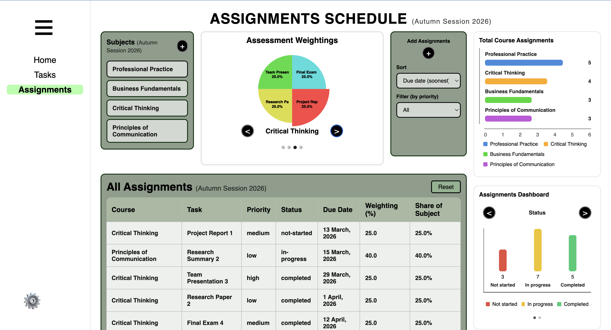

# STELLIS - A Student Productivity Hub

A browser-based productivity web app designed to help students manage tasks, assignments, and schedules all in the one place.

My motivation behind building this project was to help me build a clean, simple system that visualises how daily work connects to larger academic goals. The focus was on clarity, usability, and creating an interface that makes planning feel calm rather than overwhelming.

*Live version: https://student-hub-lite-v1.vercel.app/*

---

## Features
- **Dashboard home page**
    - Overview of today's tasks and assignments due today
    - Calendar view for quick navigation
- **Tasks Planner**
    - Weekly and monthly planning views
    - Ability to schedule tasks across days and times
- **Assignments tracker**
    - Track assignments per subject
    - View assessment weightings
    - Assignment status tracking i.e., not started, in progress, completed
- **Interactive visualisations**
    - Multiple widgets and visual charts for quick reference
    - Charts showing assignment weightings per assessment for a subject
    - Progress and priority dashboards
- **Dark Mode**
    - Toggle between light and dark mode interfaces to account for different user preferences
- **Data Storage**
    - For now, all data is stored within the browser via localStorage

---

## Screenshots
### Dashboard Overview


### Weekly Task Planner


### Monthly Calendar View


### Assignment Analytics & Visual Widgets


### Dark Mode


---

## Tech Stack
- **HTML**
- **CSS**
- **JavaScript** (vanilla)
- **Chart.js** for data visualisations
- **Vercel** for deployment

---

## Running the Project (locally)
Clone the repoistory:
```bash
https://github.com/spncr1/student-hub-lite-v1.git
```

Run the development server:
```bash
npm run dev
```

Then open the local URL shown in the terminal by clicking on it.

---

## Future Improvements
Some ideas for future iterations:
- User accounts and cloud storage
- Login page
- Mobile optimisation
- Notifications & reminder systems
- Additional producitivity analytics & visuals
- Additional features with practical usage beyond school/university